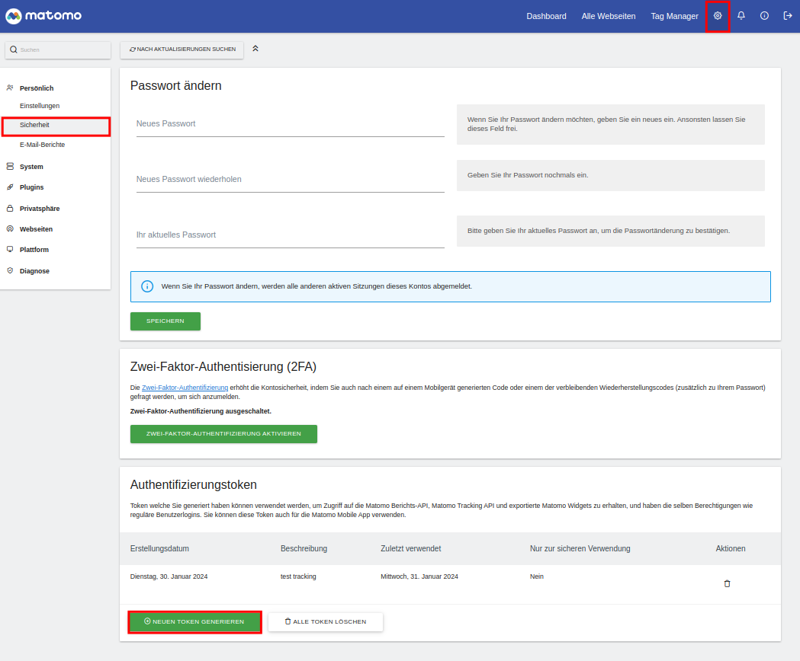
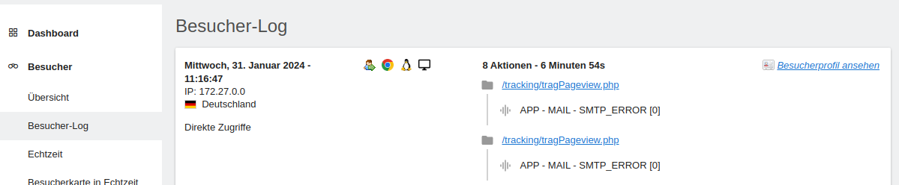
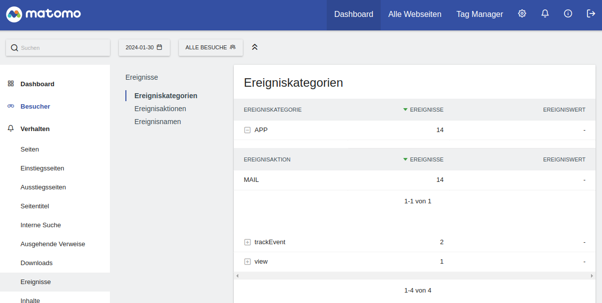

if you want to track events, like a click, an error or a login try,
you can do this serverside without cookies, with matomo.

First [download](https://matomo.org/download/) and install matomo.

Then you need an authentification token.

Navigate to Settings -> Personal -> Security.
Generate an authentication token.



For the tracking script, download and include the [matomo php tracker script](https://github.com/matomo-org/matomo-php-tracker).


```php

// Required variables
$matomoSiteId = 1; // Site ID
$matomoUrl = "http://localhost/matomo"; // Your matomo URL
$matomoToken = "xyxyxyxyxyxyxyxyxyxyxyxyxyxyxyxy"; // Your authentication token

// Optional variable
$matomoPageTitle = ""; // The title of the page

// Load object
require_once("MatomoTracker.php");

// Matomo object
$matomoTracker = new MatomoTracker((int)$matomoSiteId, $matomoUrl);

// Set authentication token
$matomoTracker->setTokenAuth($matomoToken);

// Track page view
$res = $matomoTracker->doTrackPageView($matomoPageTitle);

//Track custom event
$matomoTracker->doTrackEvent('APP', 'MAIL', 'SMTP_ERROR');
```

The matomo cron (infos under Settings -> Diagnose -> System Check) should be created.
For testing, you can use the manual call over http
```[PATH TO MATHOMO]/misc/cron/archive.php?token_auth=xyxyxyxyxyxyxyxyxyxyxyxyxyxyxyxy```


You see user event tracking in the history


And hierarchical in the events view:
