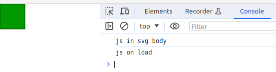
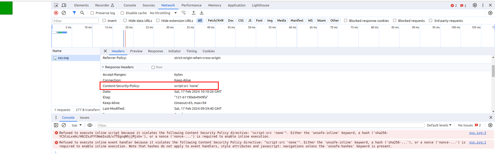

In my last post about htaccess configuration, I found these lines of code in another project:

```php
<IfModule mod_headers.c>
    <FilesMatch "\.(?i:svg)$">
        Header set Content-Security-Policy "script-src 'none'"
    </FilesMatch>
</IfModule>
```

Is it possible to inject JavaScript code in a webpage over an SVG image?

First, I create an SVG image to test it.
```xml
<svg version="1.1" baseProfile="full" xmlns="http://www.w3.org/2000/svg" onload="console.log('js on load')">
   <polygon id="triangle" points="0,0 0,50 50,50 50,0" fill="#009900" stroke="#004400"/>
   <script type="text/javascript">
      console.log('js in svg body');
   </script>
</svg>
```
This SVG image logs messages on the browser console if the scripts inside that SVG were interpreted.

If I integrate this svg in a html file, both scripts are executed
```html
<html>
    <head>
        <title></title>
    </head>
    <body>
        <svg version="1.1" baseProfile="full" xmlns="http://www.w3.org/2000/svg" onload="console.log('js on load')">
            ...
        </svg>
    </body>
</html>
```

But it is not usual to integrate some code from users on our page, without sanitizing and filtering them.
No matter whether an SVG image or other HTML tags.
If users can insert text in an input field on our page, it's important to do that. 

## But what is with an image upload?

Let us assume that the user can upload an image, which is displayed in a gallery on our page

```html
<html>
    <head>
        <title></title>
    </head>
    <body>
        
    </body>
</html>
```

I tested it and the scripts inside the SVG image were not executed.👍    
But now, there is a file with malicious code on our server!

```https://your-website/uploads/xss.svg```

When you open the file directly, then the scripts are executed.



The attacker can use the session of the user.

## Protection

If your server adds the following 'Content-Security-Policy' header, the scripts in the SVG image are not executed in the browser.

```php
Content-Security-Policy: script-src 'none'
```

