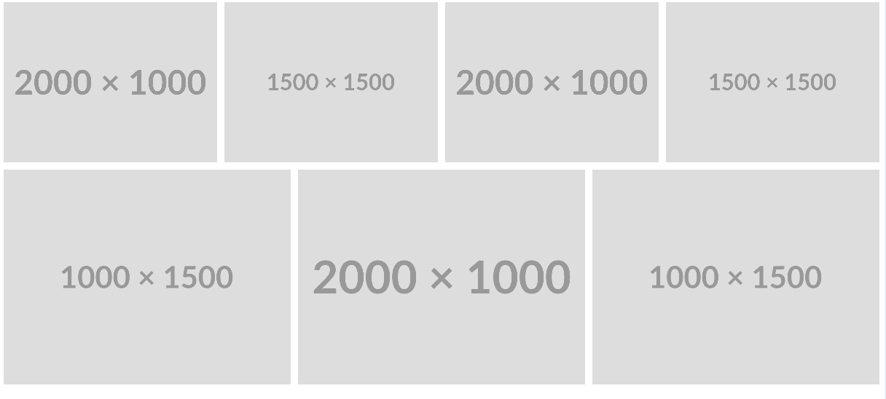

Today I saw a nice responsive image gallery.



```css
            .gallery {
                --min: 15rem;
                --aspect-ratio: 4/3;
                --gap: 10px;

                display: flex;
                flex-wrap: wrap;
                gap: var(--gap);
                list-style: none;
                padding: 0;
            }

            .gallery > li {
                flex: 1 1 var(--min);
                height: max(25vh, 15rem);
            }

            @supports (aspect-ratio: 1) {
                .gallery > li {
                    aspect-ratio: var(--aspect-ratio);
                    height: auto;
                }
            }

            .gallery img {
                display: block;
                object-fit: cover;
                width: 100%;
                height: 100%;
            }
```

In details u see that it use a aspect-ratio in combination with 'object-fit: cover':/    
It only a suitable solution if your images have a equal ratio or its okay for you only see a part of the image.    
[Here is the full example](index.html)


## Links

- [smolcss.dev](https://smolcss.dev/)
