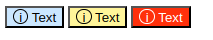

A Example:



There is a default button with a icon and a text inside.    
the button is blue by default with black text color and black icon.

```css
:root {
    --blue: #cbe7ff;
    --red: #ff300b;
    --yellow: #fff59a;
    --black: #000000;
    --white: #ffffff
}

.button {
    background-color: var(--blue);
    color: var(--black);
}

.button .icon {
    border: 1px solid var(--black);
    display: inline-block;
    width: 1em;
    height: 1em;
    border-radius: 100%;
}
```

then we need a yellow info button and a red alert button with white text.

Often, I repeate css selectors for diffrent states and override the properties: 

```css
.button--alert {
    background-color: var(--red)
    color: var(--white)
}

.button--alert .icon {
    border: 1px solid var(--white);
}

.button--info {
    background-color: var(--yellow)
    color: var(--black)
}

.button--info .icon {
    border: 1px solid var(--black);
}
```

a better way is only to override variables.
the benefit is that you only set the variables for the parent element and all child elements can also use this override values.

```css
:root {
    --blue: #cbe7ff;
    --red: #ff300b;
    --yellow: #fff59a;
    --black: #000000;
    --white: #ffffff
}

.button {
    --_background: var(--background, var(--blue));
    --_text: var(--text, var(--black));

    background-color: var(--_background);
    color: var(--_text);
}

.button .icon {
    border: 1px solid var(--_text);
    display: inline-block;
    width: 1em;
    height: 1em;
    border-radius: 100%;
}
```

Here we use 'private' css variables.
That means that the cariable is not global defined und only use in the scope of the element and his children.
To tag the css variable as 'private' use a underscore (like old javascript style to mark private vars)

For the other buttons we only override the default values with the public properties:
```css
.button--info {
    --background: var(--yellow);
}

.button--alert {
    --background: var(--red);
    --text: var(--white)
}
```

## Links

- [youtube | Using CSS custom properties like this is a waste](https://www.youtube.com/watch?v=_2LwjfYc1x8)
