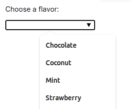
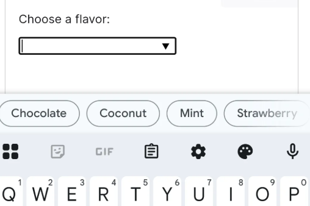

Since a few weeks I follow the mastodon bot DailyHtml.    
The bot post every day a random HTML tag from the mozilla docs.    
I see same deprecated tags but also interesting ones I don't know before.

## datalist

The `<datalist>` tag contains a list of `<option>` elements.    
A Input element can refer to this element via `list="ice-cream-flavors"`.

```html
<input list="ice-cream-flavors" id="ice-cream-choice" name="ice-cream-choice" />

<datalist id="ice-cream-flavors">
  <option value="Chocolate"></option>
  <option value="Coconut"></option>
  <option value="Mint"></option>
  <option value="Strawberry"></option>
  <option value="Vanilla"></option>
</datalist>
```

When the input is in focus then the option list is visible.



On mobile devices the optiona are shown as a button list:



You don't can influence the styling.   
Caution: The feature is not in baseline (2025-06-24), recourse Firefox has only a partial support (not for all input field types.)

### example

<input list="ice-cream-flavors" id="ice-cream-choice" name="ice-cream-choice" />

<datalist id="ice-cream-flavors">
  <option value="Chocolate"></option>
  <option value="Coconut"></option>
  <option value="Mint"></option>
  <option value="Strawberry"></option>
  <option value="Vanilla"></option>
</datalist>

## figure and figcation

The `<figcation>` provate a accessible description or legend of the contents of its parent `<figure>` element

```html
<figure>
  
  <figcaption>An elephant at sunset</figcaption>
</figure>
```

## Links

- [mozilla.org - datalist](https://developer.mozilla.org/en-US/docs/Web/HTML/Reference/Elements/datalist)
- [mozilla.org - figcaption](https://developer.mozilla.org/en-US/docs/Web/HTML/Reference/Elements/figcaption)